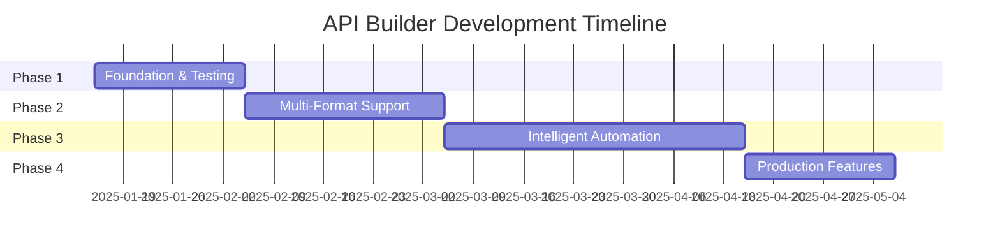

# API Builder - Development Roadmap

## 🎯 Mission Statement

Build an intelligent, automated API integration platform that eliminates the manual work of connecting to new APIs, regardless of documentation format or quality.

## 📅 Timeline Overview

## 🚀 Phase 1: Foundation (3 weeks)

**Goal**: Establish rock-solid foundation with comprehensive testing and core functionality.

### Milestone 1.1: Testing Infrastructure (Week 1)
**Deliverables**:
- Complete test suite with >80% coverage
- CI/CD pipeline with automated testing
- Pre-commit hooks for code quality

**Success Metrics**:
- All tests passing in CI
- Coverage reports generated automatically
- Zero type errors from mypy

### Milestone 1.2: Core Functionality (Week 2)
**Deliverables**:
- Fully integrated dependency resolution
- Robust error handling and recovery
- Automatic parameter extraction

**Success Metrics**:
- Successfully execute 10 different multi-step API workflows
- <1% failure rate on retry-able errors
- <500ms dependency resolution time

### Milestone 1.3: Documentation & Polish (Week 3)
**Deliverables**:
- Complete user documentation
- API reference documentation
- Architecture decision records

**Success Metrics**:
- New developer can integrate API in <30 minutes
- All public APIs documented
- Zero "how do I?" questions for basic operations

## 🔄 Phase 2: Multi-Format Support (4 weeks)

**Goal**: Support multiple API documentation formats beyond OpenAPI.

### Milestone 2.1: Parser Architecture (Week 4)
**Deliverables**:
- Abstract parser interface
- Unified internal API model
- Parser plugin system

**Success Metrics**:
- Clean separation of concerns
- New parser implementation in <1 day
- 100% backward compatibility

### Milestone 2.2: Collection Parsers (Week 5)
**Deliverables**:
- Postman collection parser
- Insomnia collection parser
- Thunder Client parser

**Success Metrics**:
- Parse 95% of standard collections
- Preserve all metadata
- Generate valid internal model

### Milestone 2.3: LLM Documentation Parser (Week 6-7)
**Deliverables**:
- LLM prompt engineering system
- Markdown/HTML documentation parser
- Confidence scoring system
- Manual correction interface

**Success Metrics**:
- 80% accuracy on well-structured docs
- 60% accuracy on poor documentation
- Human verification for low-confidence extractions

## 🤖 Phase 3: Intelligent Automation (6 weeks)

**Goal**: Build the brain that makes API integration truly automated.

### Milestone 3.1: Execution Planning (Week 8-9)
**Deliverables**:
- Dependency graph builder
- Topological sort implementation
- Parallel execution optimizer
- Plan visualization

**Success Metrics**:
- Generate valid plans for 100% of endpoints
- Identify all parallelization opportunities
- <100ms plan generation time

### Milestone 3.2: Stateful Execution (Week 10-11)
**Deliverables**:
- Execution context manager
- Automatic value extraction
- Parameter injection system
- Rollback mechanism

**Success Metrics**:
- Successfully chain 10+ API calls
- Zero manual parameter entry for chains
- Graceful rollback on failure

### Milestone 3.3: Natural Language Interface (Week 12-13)
**Deliverables**:
- Goal description language
- LLM-based goal interpreter
- Clarification dialog system
- Success verification

**Success Metrics**:
- Understand 80% of common goals
- Ask clarifying questions when ambiguous
- Verify goal achievement automatically

## 🏭 Phase 4: Production Features (3 weeks)

**Goal**: Make the tool production-ready and extensible.

### Milestone 4.1: Plugin System (Week 14)
**Deliverables**:
- Plugin interface specification
- Plugin loader and manager
- Example plugins
- Plugin documentation

**Success Metrics**:
- Load plugins without restart
- No performance impact from plugins
- Plugin crashes don't affect core

### Milestone 4.2: Output Adapters (Week 15)
**Deliverables**:
- CSV export adapter
- Google Sheets integration
- Database export adapter
- Webhook notifications

**Success Metrics**:
- Export to all formats without data loss
- Real-time streaming for large datasets
- Configurable field mapping

### Milestone 4.3: Deployment (Week 16)
**Deliverables**:
- Docker container
- Kubernetes manifests
- Helm chart
- Cloud deployment guide

**Success Metrics**:
- Single command deployment
- Horizontal scalability
- Zero-downtime updates

## 🎨 Future Phases (Post-MVP)

### Phase 5: Enterprise Features
- Team collaboration
- Role-based access control
- Audit logging
- SSO integration
- API governance tools

### Phase 6: Advanced Intelligence
- ML-based parameter prediction
- Anomaly detection
- Performance optimization
- Automated testing generation
- API compatibility checking

### Phase 7: Platform Expansion
- Web UI version
- VSCode extension
- Cloud-hosted SaaS offering
- Mobile app
- API marketplace

## 📊 Success Metrics

### Technical KPIs
- **Test Coverage**: >80%
- **Type Coverage**: >95%
- **Performance**: <100ms dependency resolution
- **Reliability**: >99% success rate
- **Scalability**: Handle 1000+ endpoints

### Business KPIs
- **Time to Integration**: <5 minutes for new API
- **User Efficiency**: 10x faster than manual integration
- **Format Support**: 5+ input formats
- **Community**: 100+ GitHub stars
- **Adoption**: 1000+ monthly active users

## 🚨 Risk Mitigation

### Technical Risks
| Risk | Probability | Impact | Mitigation |
|------|------------|--------|------------|
| LLM parsing inaccuracy | High | Medium | Manual verification, confidence scoring |
| API rate limiting | Medium | High | Exponential backoff, caching |
| Complex dependencies | Medium | High | Circular detection, manual override |
| Performance issues | Low | Medium | Profiling, optimization, caching |

### Project Risks
| Risk | Probability | Impact | Mitigation |
|------|------------|--------|------------|
| Scope creep | High | High | Strict phase boundaries |
| Technical debt | Medium | Medium | Regular refactoring sprints |
| Dependency changes | Low | High | Version pinning, testing |

## 🎯 Definition of Done

Each phase is complete when:
1. All tests passing (>80% coverage)
2. Documentation updated
3. Code reviewed and approved
4. Performance benchmarks met
5. User acceptance testing passed
6. Deployed to staging environment

## 📈 Measurement & Tracking

### Weekly Metrics
- Lines of code changed
- Test coverage percentage
- Open issues/bugs
- Completed user stories
- Performance benchmarks

### Phase Reviews
- Stakeholder demo
- Retrospective meeting
- Metrics analysis
- Roadmap adjustment
- Success celebration

---

*This roadmap is a living document. Updates monthly or after each phase completion.*
*For day-to-day tasks, see [TODO.md](../TODO.md)*