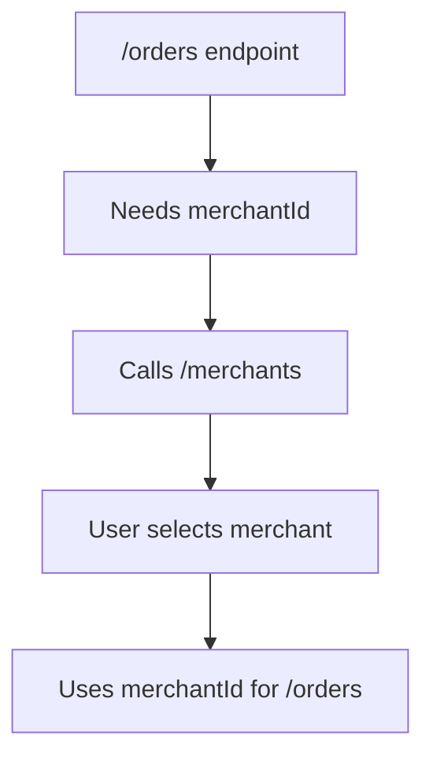

# API Builder User Guide

Welcome to API Builder! This comprehensive guide will help you get started with automatically transforming API documentation into working Python SDKs with intelligent CLI interfaces.

## Table of Contents

- [Getting Started](#getting-started)
- [Installation](#installation)
- [First API Integration](#first-api-integration)
- [Common Workflows](#common-workflows)
- [Basic Usage](#basic-usage)
- [Advanced Features](#advanced-features)
- [Examples](#examples)
- [Troubleshooting](#troubleshooting)

## Getting Started

API Builder is an intelligent automation platform that eliminates the manual work of API integration by:

- **Parsing any API documentation format** (OpenAPI, Postman, or plain text)
- **Generating type-safe Python SDKs** with full IDE support
- **Resolving complex parameter dependencies** automatically
- **Creating intelligent CLI interfaces** for interactive API exploration
- **Executing multi-step API workflows** without manual intervention

### What Makes API Builder Different

Unlike traditional code generators, API Builder understands the relationships between API endpoints and can automatically resolve parameter dependencies. For example, if you need a `merchantId` to call `/orders`, it will automatically call `/merchants` first and let you select the merchant interactively.

## Installation

### Prerequisites

- **Python 3.12+** (we recommend using [pyenv](https://github.com/pyenv/pyenv))
- **Poetry** for dependency management
- **Git** for version control

### Quick Install

```bash
# Clone the repository
git clone https://github.com/cvanleer/api-builder.git
cd api-builder

# Install dependencies
poetry install

# Activate the virtual environment
poetry shell
```

### Verify Installation

```bash
# Check if everything is working
poetry run python cli/main.py --help
```

You should see the API Builder CLI help menu with available commands.

## First API Integration

Let's walk through integrating your first API step by step.

### Step 1: Prepare Your API Documentation

API Builder currently supports OpenAPI specifications. Place your OpenAPI spec file in the `openapi/` directory:

```bash
# Example: OpenAI API
cp your-api-spec.json openapi/openai.json
```

### Step 2: Generate the API Client

```bash
# Generate Python SDK from your OpenAPI spec
poetry run python scripts/regen_client.py
```

This creates a type-safe Python client with methods for each endpoint.

### Step 3: Set Up Authentication

```bash
# Configure your API credentials
poetry run python cli/main.py auth get-token
```

Enter your email and password when prompted. API Builder securely encrypts and stores your credentials for automatic token refresh.

### Step 4: Explore Your API

```bash
# Launch the interactive API explorer
poetry run python cli/main.py system query-api
```

This command will:
1. Show you all available endpoints
2. Let you select an endpoint to call
3. Automatically resolve any parameter dependencies
4. Execute the API call and show results

### Step 5: Save and Replay Commands

```bash
# View your command history
poetry run python cli/main.py system history

# Replay a previous command
poetry run python cli/main.py system replay 0
```

## Common Workflows

### Workflow 1: Data Exploration

Perfect for discovering what data is available in your API:

```bash
# Start with simple endpoints (no parameters)
poetry run python cli/main.py system query-api
# Select endpoints like /merchants, /locations, /users

# Then explore related data
# API Builder will automatically use IDs from previous calls
```

### Workflow 2: Report Generation

Great for extracting data for analysis:

```bash
# Set date ranges for time-series data
poetry run python cli/main.py system set-defaults

# Query endpoints with date parameters
# API Builder uses your defaults automatically

# Save results to files for analysis
# Choose 'clean' option to get human-readable data
```

### Workflow 3: API Testing

Useful for validating API behavior:

```bash
# Test different parameter combinations
# Use history to track what works

# Replay successful calls to verify consistency
poetry run python cli/main.py system replay <index>
```

## Basic Usage

### Connecting to an API

1. **Add your OpenAPI specification** to `openapi/your-spec.json`
2. **Regenerate the client** with `poetry run python scripts/regen_client.py`
3. **Set up authentication** with `poetry run python cli/main.py auth get-token`

### Authentication

API Builder supports several authentication methods:

- **Bearer Token**: Most common for REST APIs
- **API Key**: Via headers or query parameters
- **OAuth 2.0**: Automatic token refresh

```bash
# Get a new token
poetry run python cli/main.py auth get-token

# Tokens are automatically refreshed every 24 hours
```

### Making Your First Call

```bash
# Interactive mode (recommended for beginners)
poetry run python cli/main.py system query-api

# Or use the interactive terminal
poetry run python interactive_terminal.py
```

The interactive mode will guide you through:
1. Selecting an endpoint
2. Providing required parameters  
3. Reviewing the API call before execution
4. Saving results to files

### Understanding Parameter Resolution

API Builder's key feature is automatic parameter dependency resolution:



Example flow:
1. You want to call `/orders` 
2. API Builder detects it needs `merchantId`
3. It automatically calls `/merchants` first
4. You select a merchant from the results
5. API Builder uses that ID to call `/orders`

## Advanced Features

### Multi-Step Workflows

API Builder can chain multiple API calls automatically:

```bash
# Example: Get orders for a specific location
# 1. API Builder calls /merchants (to get merchantId)  
# 2. Then calls /locations (filtered by merchantId)
# 3. You select a location
# 4. Finally calls /orders (with locationId and merchantId)
```

### Custom Parameter Detection

The system intelligently detects parameter types:

- **Foreign Keys**: `merchantId`, `userId`, `locationId`
- **Dates**: `startDate`, `endDate`, `createdAt`
- **Pagination**: `page`, `limit`, `pageSize`
- **Filters**: `status`, `type`, `category`
- **Enums**: Provides dropdown choices

### Error Recovery

When API calls fail, API Builder provides helpful recovery options:

```bash
# Failed calls are logged with full context
# You can retry with modified parameters
# Or skip failed dependencies and provide values manually
```

### Data Cleaning

API Builder can clean API responses for better readability:

```bash
# When saving results, choose 'clean' option
# Replaces IDs with human-readable names
# Uses lookup files (e.g., locations.json)
```

## Examples

### Example 1: Basic Data Retrieval

```bash
# Start the CLI
poetry run python cli/main.py system query-api

# Select "0" for /merchants endpoint
# No parameters required - API Builder calls directly
# Results show all merchants

# Save to file when prompted
# Choose filename: "merchants.json"
```

### Example 2: Complex Multi-Step Query

```bash
# Select "/orders" endpoint (requires merchantId and locationId)
# API Builder automatically:
#   1. Calls /merchants first
#   2. Shows table of merchants
#   3. You select row 0 for "Main Store"
#   4. Calls /locations with merchantId
#   5. Shows locations for Main Store
#   6. You select row 2 for "Downtown Location"
#   7. Calls /orders with both IDs
#   8. Shows orders for that specific location
```

### Example 3: Date Range Queries

```bash
# Set default date ranges
poetry run python cli/main.py system set-defaults

# Query time-series endpoints like /analytics or /reports
# API Builder uses your date defaults automatically
# Results include data for the past 7 days (default range)
```

### Example 4: Pagination Handling

```bash
# Query large datasets like /transactions
# API Builder automatically:
#   1. Starts with page 1
#   2. Fetches all available pages
#   3. Combines results into single dataset
#   4. Shows total count of items
```

### Example 5: Command History and Replay

```bash
# View your recent commands
poetry run python cli/main.py system history

# Output:
# #  Timestamp           Endpoint      Parameters                    Status
# 0  2024-01-15 10:30:15  /merchants    page=1, limit=50             ✅
# 1  2024-01-15 10:32:45  /orders       merchantId=123, page=1       ✅
# 2  2024-01-15 10:35:12  /analytics    startDate=2024-01-08, ...    ❌

# Replay successful command
poetry run python cli/main.py system replay 1
```

## Troubleshooting

For common issues and solutions, see our [Troubleshooting Guide](TROUBLESHOOTING.md).

### Quick Fixes

**Problem**: "Authentication failed"
```bash
# Solution: Refresh your token
poetry run python cli/main.py auth get-token
```

**Problem**: "Endpoint not implemented in client mapping"
```bash
# Solution: Regenerate the API client
poetry run python scripts/regen_client.py
```

**Problem**: "No provider found for parameter"
```bash
# Solution: Provide the value manually when prompted
# Or check if the parameter is spelled correctly in your OpenAPI spec
```

## Next Steps

Once you're comfortable with the basics:

1. **Explore the Examples** directory for script-based usage
2. **Read the API Reference** for programmatic usage
3. **Check the Troubleshooting Guide** for common issues
4. **Join our GitHub Discussions** for community support

---

## Need Help?

- **Issues**: [GitHub Issues](https://github.com/cvanleer/api-builder/issues)  
- **Discussions**: [GitHub Discussions](https://github.com/cvanleer/api-builder/discussions)
- **Documentation**: [Full Documentation](README.md)

Happy API building! 🚀